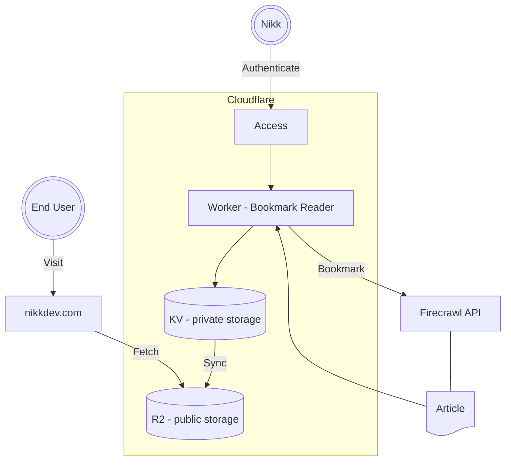
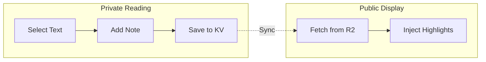

# Building My Own Read-Later App (and Saving $96/Year)

I woke up to a Readwise billing notification: \$8 charged. That's \$96 a year for a service I use maybe a dozen times a week. There had to be a better way.

*👀 Sneak peek of the better way as it turns out*
<video autoplay loop muted playsinline style="max-width: 100%; width: 600px;">
  <source src="https://r2.nikkdev.com/blog/Bookmark%20Reader.webm" type="video/webm">
</video>

## The Problem

Like many knowledge workers, I'm a chronic article hoarder. I stumble upon interesting articles across the web and bookmark them for "later." Readwise was my go-to for this workflow: save article, read it later with nice formatting, annotate the good bits.

But $8/month felt steep for what's essentially a fancy web scraper with a cross-platform reader UI. So I went hunting for alternatives:

- **Instapaper**: Also expensive
- **Raindrop.io**: Free tier lacks annotation and content scraping/download
- **Pocket**: Dead
- **Self-hosted solutions**: Linkwarden looked promising, but I don't have the infrastructure ready for it

Okay, so I'm checking out what I've got already: a static site on GitHub Pages, and a Cloudflare account that's super generous with its free tier (like R2 storage, Workers, and Access for authentication). What if I just... built my own?

## The Firecrawl Discovery

The trickiest part of any read-later app is web scraping. Modern websites are hostile to bots. Paywalls, JavaScript rendering, anti-crawling measures - it's a minefield. Even paid services like Readwise struggle with certain sites.

I tested a few articles that does not play well with Readwise:
- [This ngrok blog post on prompt caching](https://ngrok.com/blog/prompt-caching/) -> Readwise couldn't crawl it at all
- [An Increase.com article on ISO 8583](https://increase.com/articles/iso-8583-the-language-of-credit-cards) -> all images are broken

Then I found [Firecrawl](https://firecrawl.dev), one API call, and it returns clean markdown with images intact. The free tier offers more than enough for my dozen articles a week habit. I tested it against my problem articles - flawless.

Now I had a plan.

## Building with Claude Code

Here's where things got interesting. I didn't write most of this myself. I paired with Claude Code, and together we shipped the entire feature in about 2 days.

### Architecture Overview

### Step 1: Building the Bookmark reader

I prompt Claude Code to build a Cloudflare Worker that does the following:
- Create bookmark:
    - Accepts a URL to bookmark
    - Detects PDF URLs and uses appropriate parser
    - Calls Firecrawl to scrape the content
    - Stores the markdown in R2 with metadata
- Read bookmark:
    - Serves a web UI to read saved bookmarks
    - Tracks reading progress and annotations in KV
- Syncs bookmarks:
    - Sync reading progress and annotations
    - nikkdev.com fetches progress and annotations to display for public viewing, since it's my blog hence I want to share what I'm currently reading and my takes on it (annotations)

> Initially, I had two separate Workers: one for scraping and one for reading. Then my wife asked why I need two separate services? Touché. So I asked Claude Code to combine them into a single Worker that handles both.

Since the Bookmark Reader is only for me, I need an access control layer and luckily Cloudflare Access makes that trivial. I set up Github SSO and next time I can just login to the Bookmark Reader with my GitHub credentials.

### Step 2: The Terminal Command

The fun part. My website is a terminal emulator, so naturally bookmarks needed a command. I treat it bookmarks like files hence we can reuse existing terminal commands:

- `ls bookmarks/` - Lists all bookmarks
- `cat bookmarks/<bookmark-name>` - Renders the full article with my highlights and notes inline

## Feature Deep Dive

### The Annotation System

When I read an article in my private Worker UI, I can highlight text and add notes. These sync back to KV storage. When someone views the public bookmark on my site, they see my annotations inline - highlighted passages with my thoughts in speech bubbles beneath them.

### Reading Progress

The terminal view shows where I stopped reading each article - a visual marker that says "Nikk is currently reading here".

### Favourites & Organization

Articles can be marked as favourites (shown with a star indicator), marked as read, or deleted entirely. The Worker UI has tabs for Unread/Read/Favourites filtering.

## The Results

**What I built:**
- A private bookmark manager at my Cloudflare Worker URL
- A public view of my reading list via the `bookmark` command on this site
- Reading progress tracking, annotations, and favourites
- PDF scraping support

**What it cost:**
- $0/month (Firecrawl free tier, Cloudflare free tier, GitHub Pages)
- Two days of building with Claude Code

**The trade-offs:**
- Some sites still don't work (NYTimes defeated even Firecrawl)
- Unrelated content is not filtered out (e.g. ads, comments)

You can try it yourself - type `ls bookmarks/` below to see what I'm reading.

## The Real MVP: Claude Code

Let me be clear: this project would have taken me weeks to build alone. The Cloudflare Worker alone has auth handling, R2 operations, Firecrawl integration, and a full reading UI with annotation support. The React components have lazy loading, markdown rendering with custom HTML injection, progress animations, and styled-components theming.

Claude Code wrote all of it. I described what I wanted, reviewed the code, tested it, and iterated. The git history tells the story -> rapid iteration, each commit adding features or fixing bugs that Claude identified and resolved.

Without Claude Code, I'd still be paying Readwise. With it, I have a custom solution that does exactly what I need, looks exactly how I want, and costs exactly nothing.

Sometimes the best tool is the one you build yourself, especially when you have an AI pair programmer who can actually ship.
